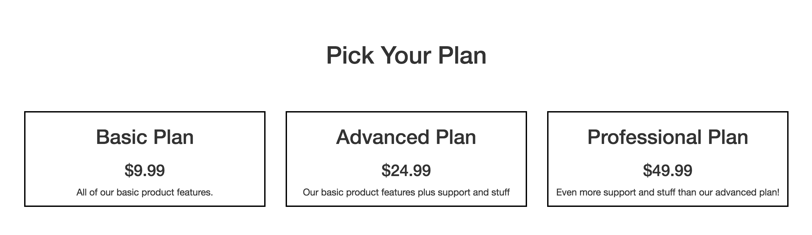
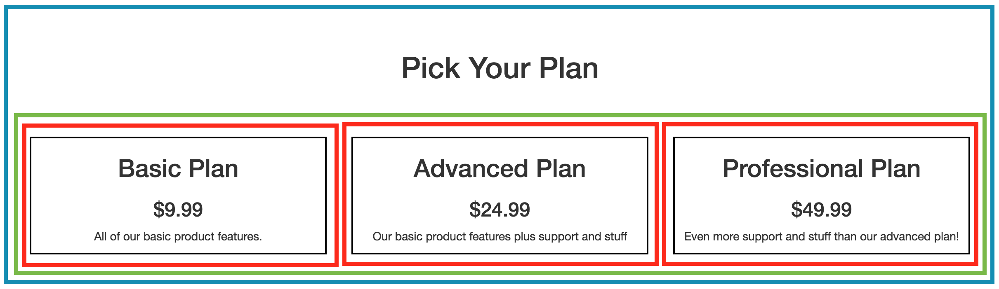

# Welcome to Bootstrap

## What is Bootstrap?

Bootstrap is a CSS and JavaScript library that makes web development faster and easier. It includes components for typography, forms, buttons, tables, and more as well as a robust grid system to help create responsive layouts with ease.

Bootstrap is free and open source which makes it an easy choice for both basic and complex projects. It is compatible across all browsers and enforces consistent design.

## How to use Bootstrap

Bootstrap is simply one CSS and one JavaScript file that you reference from your HTML pages. The following boilerplate is based on the [Bootstrap getting started guide](http://getbootstrap.com/getting-started/):

```html
<!DOCTYPE html>
<html lang="en">
  <head>
    <meta charset="utf-8">
    <meta http-equiv="X-UA-Compatible" content="IE=edge">
    <meta name="viewport" content="width=device-width, initial-scale=1">
    <!-- The above 3 meta tags *must* come first in the head; any other head content must come *after* these tags -->

    <title>Bootstrap Template</title>

    <!-- Bootstrap -->
    <link rel="stylesheet" href="https://maxcdn.bootstrapcdn.com/bootstrap/3.3.7/css/bootstrap.min.css" integrity="sha384-BVYiiSIFeK1dGmJRAkycuHAHRg32OmUcww7on3RYdg4Va+PmSTsz/K68vbdEjh4u" crossorigin="anonymous">
  </head>
  <body>
    <h1>Hello, world!</h1>

    <!-- jQuery (necessary for Bootstrap's JavaScript plugins) -->
    <script src="https://ajax.googleapis.com/ajax/libs/jquery/1.12.4/jquery.min.js"></script>
    <!-- Include all compiled plugins (below), or include individual files as needed -->
    <script src="https://maxcdn.bootstrapcdn.com/bootstrap/3.3.7/js/bootstrap.min.js" integrity="sha384-Tc5IQib027qvyjSMfHjOMaLkfuWVxZxUPnCJA7l2mCWNIpG9mGCD8wGNIcPD7Txa" crossorigin="anonymous"></script>
  </body>
</html>
```

This boilerplate downloads Bootstrap from a **CDN**, or Content Delivery Network. A CDN is simply a service that stores your files remotely for easier use. If you use a CDN, there is no need to download Bootstrap and store it in your project.

## A brief tour of Bootstrap

### Layout

##### Containers

Your content should be wrapped inside one of Bootstrap's container classes: `.container` or `.container-fluid`. Fluid containers will span the full width of the page whereas normal contains have margins that center your content on the page. It is important to note that contains _should not be nested_. Here is an example of using containers:

```html
<body>
  <div class="container-fluid">
    <h1>This container spans the full width of the page and is good for titles and images.</h1>
  </div>

  <div class="container">
    <h3>This is a normal container</h3>
    <p>Normal containers are best for normal page content like paragraphs</p>
  </div>
</body>
```

##### The Grid System

Bootstrap provides grid classes that help you define the layout of your page. The grid contains 12 columns; each column must be contained within a row. Lets look at an example of a common pattern for a pricing page on a website:



If we highlight the container in blue, the row in green, and the columns in red, we find the following:



A good rule of thumb is that anytime you want items to appear side by side, you should put them in a row. Then, use the column classes to define the width of each item on the page. Here is the code that made the above example:

```html
<div class="container">
  <h1 class="text-center">Pick Your Plan</h1>
  <div class="row">
    <div class="col-sm-4">
      <div class="bordered">
        <h2>Basic Plan</h2>
        <h3>$9.99</h3>
        <p>All of our basic product features.</p>
      </div>
    </div>
    <div class="col-sm-4">
      <div class="bordered">
        <h2>Advanced Plan</h2>
        <h3>$24.99</h3>
        <p>Our basic product features plus support and stuff</p>
      </div>
    </div>
    <div class="col-sm-4">
      <div class="bordered">
        <h2>Professional Plan</h2>
        <h3>$49.99</h3>
        <p>Even more support and stuff than our advanced plan!</p>
      </div>
    </div>
  </div>
</div>
```

You'll notice that the columns in this example use the class `col-sm-4`. What does that mean? Every column class has three parts: a column prefix (`col`), a device width (`xs`, `sm`, `md`, or `lg`), and a column width (any number from 1 to 12). The device width is the most complicated part: it defines which screen size the rule should apply to. For example, `col-sm-4` will keep my columns at width 4 until I move to an extra small screen at which point they will each take up all 12 columns (the full screen width). You can define multiple rules on a div, for example:

```html
<div class="col-sm-4 col-md-6 col-lg-8"></div>
```

This div will occupy the default 12 columns on extra small screens, 4 columns on small screens, 6 columns on medium screens, and 8 columns on large screens.

There are a few other grid helpers you can read about in the [Bootstrap docs](http://getbootstrap.com/css/#grid). Once you've mastered the basic grid, you will be able to make almost any layout you commonly see on the web.

### Typography

By default, Bootstrap will override the typography of your project to make it look clean and consistent. You are welcome to override font sizes, font families, spacing, and any other typographical property at anytime.

### Navbars

Bootstrap provides a few navigation bars by default. Navbars can be time consuming to create and maintain from scratch, making them one of the best parts of the bootstrap framework. From the [bootstrap documentation](http://getbootstrap.com/components/#navbar), you can find the following navbar:


produced by this sample code:

```html
<nav class="navbar navbar-default">
  <div class="container-fluid">
    <!-- Brand and toggle get grouped for better mobile display -->
    <div class="navbar-header">
      <button type="button" class="navbar-toggle collapsed" data-toggle="collapse" data-target="#bs-example-navbar-collapse-1" aria-expanded="false">
        <span class="sr-only">Toggle navigation</span>
        <span class="icon-bar"></span>
        <span class="icon-bar"></span>
        <span class="icon-bar"></span>
      </button>
      <a class="navbar-brand" href="#">Brand</a>
    </div>

    <!-- Collect the nav links, forms, and other content for toggling -->
    <div class="collapse navbar-collapse" id="bs-example-navbar-collapse-1">
      <ul class="nav navbar-nav">
        <li class="active"><a href="#">Link <span class="sr-only">(current)</span></a></li>
        <li><a href="#">Link</a></li>
        <li class="dropdown">
          <a href="#" class="dropdown-toggle" data-toggle="dropdown" role="button" aria-haspopup="true" aria-expanded="false">Dropdown <span class="caret"></span></a>
          <ul class="dropdown-menu">
            <li><a href="#">Action</a></li>
            <li><a href="#">Another action</a></li>
            <li><a href="#">Something else here</a></li>
            <li role="separator" class="divider"></li>
            <li><a href="#">Separated link</a></li>
            <li role="separator" class="divider"></li>
            <li><a href="#">One more separated link</a></li>
          </ul>
        </li>
      </ul>
      <form class="navbar-form navbar-left">
        <div class="form-group">
          <input type="text" class="form-control" placeholder="Search">
        </div>
        <button type="submit" class="btn btn-default">Submit</button>
      </form>
      <ul class="nav navbar-nav navbar-right">
        <li><a href="#">Link</a></li>
        <li class="dropdown">
          <a href="#" class="dropdown-toggle" data-toggle="dropdown" role="button" aria-haspopup="true" aria-expanded="false">Dropdown <span class="caret"></span></a>
          <ul class="dropdown-menu">
            <li><a href="#">Action</a></li>
            <li><a href="#">Another action</a></li>
            <li><a href="#">Something else here</a></li>
            <li role="separator" class="divider"></li>
            <li><a href="#">Separated link</a></li>
          </ul>
        </li>
      </ul>
    </div><!-- /.navbar-collapse -->
  </div><!-- /.container-fluid -->
</nav>
```

### Much, much more

Bootstrap has hundreds of component and css classes that you can easily use in your project. The best way to learn about Bootstrap's features is to visit their documentation and explore the given examples. Here are some other popular items included in bootstrap:

* [Glyphicons](http://getbootstrap.com/components/#glyphicons), a built-in icon library for use on your site.
* [Consistent, well-formatted buttons](http://getbootstrap.com/css/#buttons), including a variety of colors and sizes.
* [Form components](http://getbootstrap.com/css/#forms) to make user input consistent across browsers
* [Jumbotron](http://getbootstrap.com/components/#jumbotron) - a great start for a website landing page.
